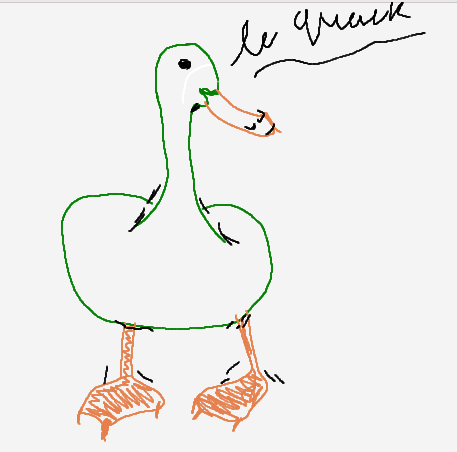
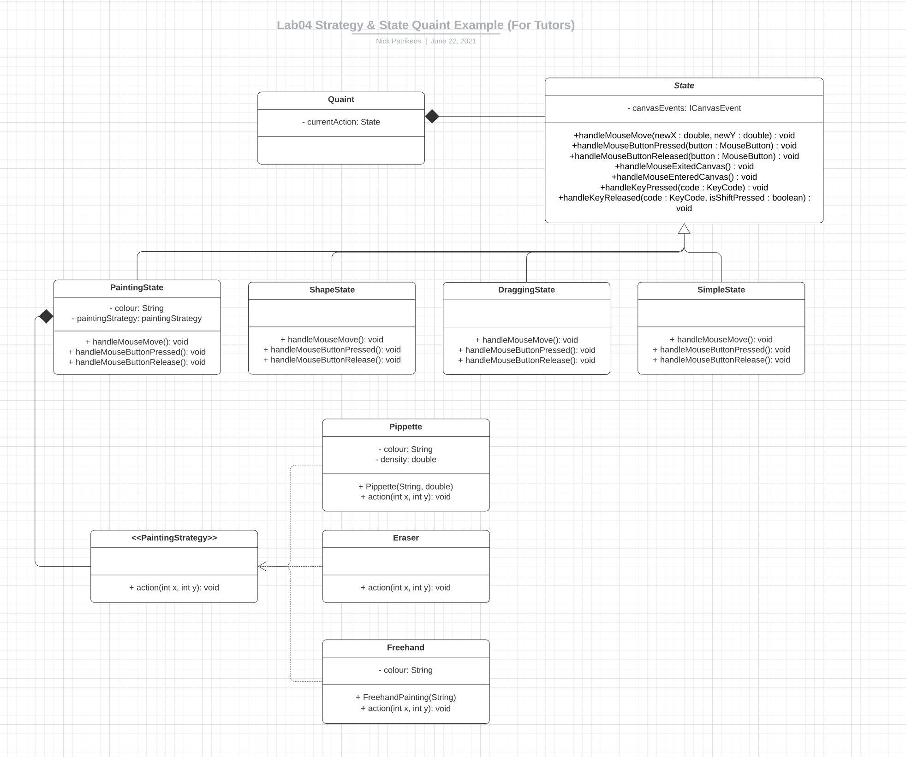
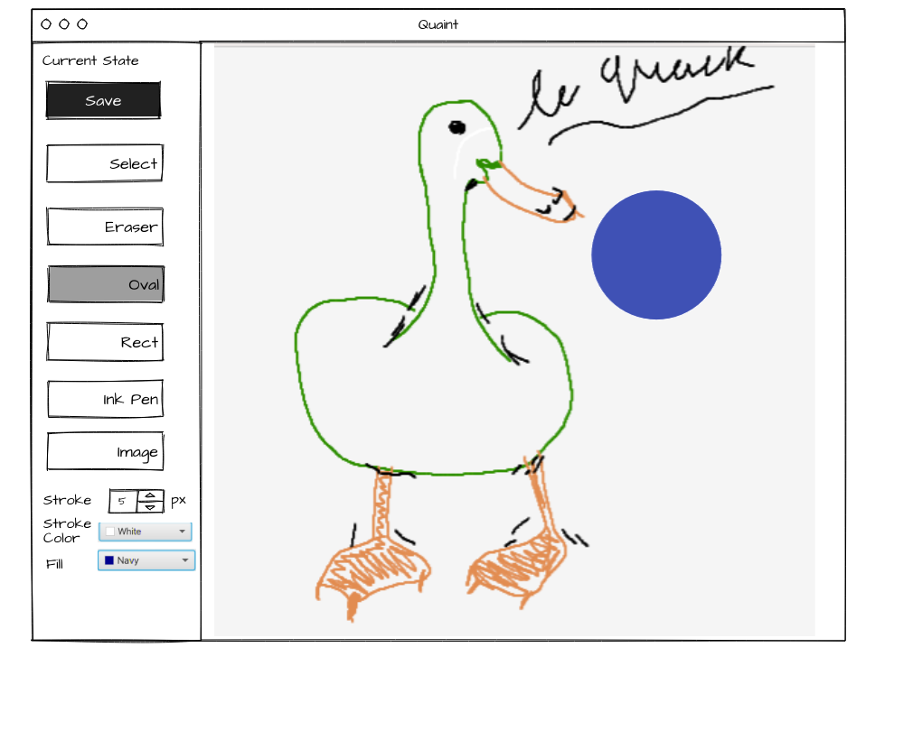

# Quaint - A Java Painting Application

> Made by Braedon Wooding for a tute in COMP2511 (@UNSW).

Consists of a relatively simple example of showing patterns at a non trivial scale, the code currently sits around 1k lines and is relatively complex but should be abstracted well enough to be simple.

There are a few bugs around certain aspects since it was written relatively quickly (within 5-6 hrs) and was more focused on the design.  Most are trivial to fix and I may get around to them eventually (PRs welcome if you really want...).

Currently you can;

- The ability to draw shapes such as rectangles and ovals, you should be able to give shapes constant aspect ratios by holding shift while dragging
- The ability to select a region then perform operations on it, regions are selected via a box
  - You can delete a region with ctrl + d
  - You can paste a region with ctrl + v, this won't clear the old region and will just paste it (i.e. copy + paste)
- The ability to paint using a brush like tool
- The ability to remove mistakes
- The ability to save my picture out to a location of my choosing
- The ability to load an image onto the canvas by clicking the image load tool, selecting the image you want to insert, then clicking where you want to insert it.
  - After placing the image it should return to just the simple cursor.
- The ability to change colours using a colour wheel for the strokes and shapes
- A new pipette tool that appears next to the colour selector that lets you pick the stroke/fill colour based upon the canvas.

The uml is here; [UML](Quaint.pdf) (it's quite large).

But a simpler uml is below, this overly trivialises certain relationships but is a rough grasp at how everything relates to each other.  It was drawn by a fellow course admin Nick Patrikeos.

There is also a wireframe.

## Running

You'll want JavaFX to run this.  No other dependencies.
